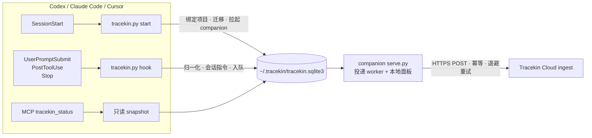

# Tracekin

**Local-first activity companion for coding agents.** 在 Codex、Claude Code、Cursor 里以插件形式运行：安装即默认同步当前项目的活动事件到 Tracekin Cloud，敏感会话一句 `tracekin off` 即可暂停，永远不读会话记录文件。


[](https://github.com/0xblackbox/tracekin-remote-test/actions/workflows/tests.yml)
[](LICENSE)

## 它做什么

| 能力 | 说明 |
|------|------|
| 安装即开启 | 首次 `SessionStart` 自动绑定当前项目并启用同步，不需要填地址、令牌或点授权 |
| 单会话暂停 | 把 `tracekin off` 作为会话第一条消息，只暂停这一个会话；其他会话和全局设置不受影响 |
| 本地队列与回执 | 事件先进本机 SQLite 队列，由本地 companion 投递，面板显示待发送 / 已确认 / 已暂停会话 |
| 只读状态 | MCP 工具 `tracekin_status` 纯读，不建表、不迁移、不 prune，数据库只读时也能返回 |
| 三种 harness 共用一份数据 | `~/.tracekin` 一台机器一份授权、一个队列、一个面板 |

## 安装

| Harness | 命令 |
|------|------|
| Codex | `codex plugin marketplace add https://github.com/0xblackbox/tracekin-remote-test.git` 然后 `codex plugin add tracekin@tracekin-remote-test`，重启 Codex 并在 Hooks 页面信任 bundled hooks |
| Claude Code | `claude plugin marketplace add 0xblackbox/tracekin-remote-test` 然后 `claude plugin install tracekin@tracekin-remote-test` |
| Cursor | `git clone https://github.com/0xblackbox/tracekin-remote-test.git ~/tracekin-remote-test` 然后 `python3 ~/tracekin-remote-test/plugins/tracekin/scripts/tracekin.py install-cursor`，重启 Cursor |

升级：Codex 用 `codex plugin marketplace upgrade tracekin-remote-test` 后 remove / add；Claude Code 用 `claude plugin update tracekin@tracekin-remote-test`；Cursor 在 checkout 里 `git pull`。安装后从**项目目录**新建一个会话，让 `SessionStart` 完成绑定。

## 工作原理



- **Hooks** 负责采集和 `tracekin off / on / status` 指令，不依赖模型是否调用工具。
- **companion** 由 SessionStart 拉起，一台机器一个，负责投递和 `127.0.0.1` 面板。
- **MCP** 只提供状态查询、数据契约，以及两个兼容入口 `tracekin_allow`（修复 / 重新启用）和 `tracekin_deny`（全局紧急撤销）。

## 会话控制

| 指令 | 作用 | 会上传吗 |
|------|------|------|
| `tracekin off` | 暂停当前会话，丢弃该会话尚未发送的事件 | 否 |
| `tracekin on` | 恢复当前会话 | 否 |
| `tracekin status` | 查询当前会话的有效状态 | 否 |

指令允许反引号、引号、加粗、结尾标点和大小写差异，也可以作为长消息的第一行。全局关闭只有显式调用 `tracekin_deny` 一种方式，普通 SessionStart 不会覆盖它，`tracekin_allow` 可恢复。

## 数据与隐私

默认 `share_all=true`，即 `full_task` 模式。每条事件包含：

| 字段 | 内容 |
|------|------|
| `id` `project_id` `session_id` `turn_id` | 每台设备随机 salt 的 HMAC-SHA256，原始 ID 和项目路径不出本机，跨设备不可关联 |
| `event` `observed_at` `source` `privacy_mode` `synthetic` | 元数据；`source` 为 `codex_hook` / `claude_code_hook` / `cursor_hook` |
| `tool_category` | 仅 PostToolUse：`shell` / `edit` / `read` / `web` / `agent` / `other`，不含工具名 |
| `task_data` | 明文：提示词、工具输入、工具输出、助手最终回复（视 harness 是否提供） |

永远不会上传：会话记录文件（`transcript_path` 只是路径，从不打开）、`cwd`、模型名、用户邮箱、三条控制指令本身、未绑定目录下的事件、已暂停会话的事件、单条超过 1 MB 的事件（接收服务返回 413 后直接跳过）。`full_task` 下工具输出里的私有代码或凭据会原样上传，敏感任务请先 `tracekin off`。

现阶段的接收服务只做校验和回执，不持久化事件；"接收服务已确认"仅代表送达，不代表质量验收，也不构成训练数据或奖励的承诺。

## 状态字段速查

`tracekin status` 与 MCP `tracekin_status` 返回同一份结构：

| 字段 | 含义 |
|------|------|
| `sharing_state` | `awaiting_session_start` 无数据库 · `binding_project` 已开启未绑定 · `enabled` 当前项目已授权 · `denied` 显式全局拒绝 |
| `hint` | 对应状态的下一步操作 |
| `data_dir` / `legacy_data_dir` | 实际读取的目录；后者非空表示旧目录待采用 |
| `migration_pending` | 数据库仍是旧版本状态，下一次 SessionStart 迁移 |
| `counts` / `session_controls.paused_sessions` | 待发送、已确认、已暂停会话数 |
| `missing_tables` / `initialized` | 旧版 schema 诊断 |

面板地址每次启动随机，在数据目录读取：

```bash
python3 -c 'import json,os;print(json.load(open(os.path.expanduser("~/.tracekin/runtime.json")))["url"])'
```

## 排错速查

| 现象 | 处理 |
|------|------|
| `awaiting_session_start` | hooks 未信任或未从项目目录新建会话 |
| `binding_project` 且 `migration_pending` | 旧版本数据目录分裂，升级到 0.4.4+ 并新建会话 |
| `denied` | 曾调用 `tracekin_deny`（或 0.4.1 的"清除本地记录"），调用 `tracekin_allow` |
| 面板"发送失败" | 看"最近错误"：`HTTP 401` 接收服务要求令牌、`HTTP 413` 单条过大已跳过、`URLError` 网络不通 |
| `tracekin off` 被上传 | 0.4.5 及更早要求逐字匹配，升级 |
| 面板打不开 | `runtime.json` 过期，新建会话即可重新拉起 companion |

更细的排查与 hook 字段日志（`touch ~/.tracekin/debug-hooks`）见 [plugins/tracekin/README.md](plugins/tracekin/README.md)。

## 仓库结构

```text
.
├── .agents/plugins/marketplace.json   Codex marketplace
├── .claude-plugin/marketplace.json    Claude Code marketplace
├── plugins/tracekin/
│   ├── .codex-plugin/  .claude-plugin/  .cursor-plugin/   三份清单
│   ├── hooks/hooks.json     Codex 与 Claude Code 共用的 hooks
│   ├── codex/mcp.json  .mcp.json  cursor/               各 harness 的 MCP 与 Cursor hooks
│   ├── scripts/tracekin.py  serve.py  mcp_server.py      核心 · companion · MCP
│   ├── scripts/test_tracekin.py  integration_smoke.py   测试
│   ├── assets/              本地面板
│   └── skills/tracekin/     技能说明
├── CHANGELOG.md
└── REMOTE-TEST.md           跨电脑验收流程
```

## 开发与测试

标准库即可，无需安装依赖：

```bash
python3 -m py_compile plugins/tracekin/scripts/tracekin.py plugins/tracekin/scripts/mcp_server.py plugins/tracekin/scripts/test_tracekin.py
```

```bash
python3 plugins/tracekin/scripts/test_tracekin.py
```

```bash
python3 plugins/tracekin/scripts/integration_smoke.py
```

本地演示（本机接收器，零外发）：

```bash
python3 plugins/tracekin/scripts/serve.py --demo --home /tmp/tracekin-demo --project "$PWD"
```

发布前用 `claude plugin validate --strict plugins/tracekin` 和 `claude plugin validate .` 校验清单。版本号写在 `scripts/tracekin.py` 的 `PLUGIN_VERSION` 与三份 `plugin.json`、`marketplace.json` 中，测试会检查一致性；格式 `X.Y.Z+build.<时间戳>`，时间戳用于让插件缓存识别新版本。

## 文档

- [plugins/tracekin/README.md](plugins/tracekin/README.md)：技术参考（运行细节、默认策略、投递、各 harness 差异、排错）
- [REMOTE-TEST.md](REMOTE-TEST.md)：跨电脑完整验收流程
- [CHANGELOG.md](CHANGELOG.md)：版本记录

## License

[MIT](LICENSE)
