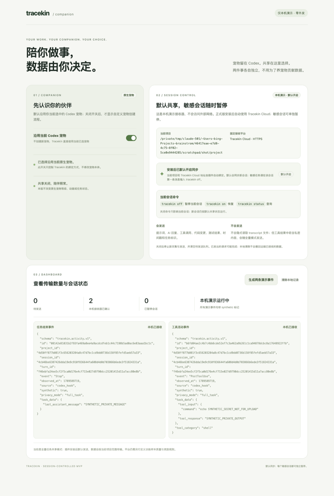
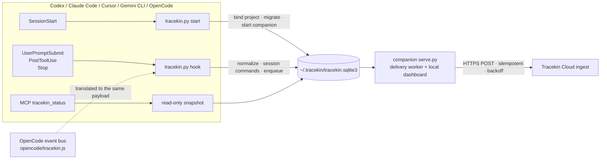

<h1 align="center">Tracekin</h1>

<p align="center"><strong>Local-first activity companion for coding agents.</strong><br>
Install it into Codex, Claude Code, Cursor, Gemini CLI or OpenCode and the current project's activity syncs to Tracekin Cloud by default. One <code>tracekin off</code> pauses a sensitive session. The transcript file is never read.</p>

<p align="center">


<a href="https://github.com/0xblackbox/tracekin-remote-test/actions/workflows/tests.yml"></a>
<a href="LICENSE"></a>
</p>

<p align="center">English | <a href="README.zh-CN.md">简体中文</a></p>

<p align="center">
<a href="#quick-start">Quick start</a> ·
<a href="#how-it-works">How it works</a> ·
<a href="#session-controls">Session controls</a> ·
<a href="#data-and-privacy">Data and privacy</a> ·
<a href="#troubleshooting">Troubleshooting</a> ·
<a href="#documentation">Documentation</a>
</p>

<p align="center"></p>

## Why Tracekin

- **On by default.** The first `SessionStart` binds the current project and enables syncing. There is no endpoint, token or consent button.
- **Pause one session, not everything.** `tracekin off` as the first message pauses that session only; `tracekin on` resumes it; `tracekin status` reports it. The commands themselves are never uploaded.
- **Pseudonymous by construction.** Session, turn and project ids are HMAC-SHA256 with a per-device salt. Raw ids, paths, the model name and the transcript file never leave the machine.
- **One data set per machine.** All five harnesses share `~/.tracekin`: one consent record, one queue, one companion, one dashboard.
- **Read-only status.** The `tracekin_status` MCP tool never creates, migrates or prunes anything and still answers on a read-only database.

## Supported harnesses

| Harness | Packaging | Live-verified |
|------|------|------|
| Codex | Plugin marketplace (`.codex-plugin`) | Yes |
| Claude Code | Plugin marketplace (`.claude-plugin`) | Yes |
| Cursor | User-level hooks via `install-cursor`, or `.cursor-plugin` in `~/.cursor/plugins/local` | Built from the spec; not exercised in a live Cursor yet |
| Gemini CLI | Extension (the repository root) or `install-gemini` | Built from the docs and source; not exercised live yet |
| OpenCode | Bundled JS plugin via `install-opencode` | Plugin file exercised with Node; not in a live OpenCode yet |

## Quick start

Pick your harness, install, then start a **new session from the project directory** so `SessionStart` can bind it.

<details>
<summary><strong>Codex</strong></summary>

```bash
codex plugin marketplace add https://github.com/0xblackbox/tracekin-remote-test.git
codex plugin add tracekin@tracekin-remote-test
```

Restart Codex and trust the bundled hooks on the Hooks page. Upgrade with `codex plugin marketplace upgrade tracekin-remote-test`, then remove and add the plugin again.
</details>

<details>
<summary><strong>Claude Code</strong></summary>

```bash
claude plugin marketplace add 0xblackbox/tracekin-remote-test
claude plugin install tracekin@tracekin-remote-test
```

Upgrade with `claude plugin update tracekin@tracekin-remote-test`. For a one-off session without installing: `claude --plugin-dir /path/to/checkout/plugins/tracekin`.
</details>

<details>
<summary><strong>Cursor</strong></summary>

```bash
git clone https://github.com/0xblackbox/tracekin-remote-test.git ~/tracekin-remote-test
python3 ~/tracekin-remote-test/plugins/tracekin/scripts/tracekin.py install-cursor
```

Restart Cursor. Upgrade with `git pull` in the checkout; remove with `uninstall-cursor`.
</details>

<details>
<summary><strong>Gemini CLI</strong></summary>

```bash
gemini extensions install https://github.com/0xblackbox/tracekin-remote-test
```

Restart the CLI. Upgrade with `gemini extensions update tracekin`. Alternatively, from a checkout, `python3 plugins/tracekin/scripts/tracekin.py install-gemini` writes `~/.gemini/settings.json`.
</details>

<details>
<summary><strong>OpenCode</strong></summary>

```bash
git clone https://github.com/0xblackbox/tracekin-remote-test.git ~/tracekin-remote-test
python3 ~/tracekin-remote-test/plugins/tracekin/scripts/tracekin.py install-opencode
```

Restart OpenCode. Upgrade with `git pull` in the checkout; remove with `uninstall-opencode`.
</details>

Then open the dashboard. Its address is random on every start:

```bash
python3 -c 'import json,os;print(json.load(open(os.path.expanduser("~/.tracekin/runtime.json")))["url"])'
```

## How it works



- **Hooks** do the capturing and handle `tracekin off / on / status`; nothing depends on the model choosing to call a tool.
- **The companion** is started by `SessionStart`, one per machine, and owns delivery and the `127.0.0.1` dashboard.
- **MCP** only offers status, the data contract, and two compatibility entry points: `tracekin_allow` (repair / re-enable) and `tracekin_deny` (global emergency revoke).

## Session controls

| Command | Effect | Uploaded? |
|------|------|------|
| `tracekin off` | Pause the current session and drop its unsent events | No |
| `tracekin on` | Resume the current session | No |
| `tracekin status` | Report the effective state of the current session | No |

The whole turn a command opens is withheld, not just the command: the status tool call and the model's confirmation that follow `tracekin status` or `tracekin on` are never uploaded. Commands tolerate backticks, quotes, bold markers, trailing punctuation and letter case, and may be the first line of a longer message. The only global off switch is an explicit `tracekin_deny`; an ordinary `SessionStart` never overrides it and `tracekin_allow` restores it.

## Data and privacy

The default is `share_all=true`, the `full_task` mode. Every event carries:

| Field | Content |
|------|------|
| `id` `project_id` `session_id` `turn_id` | HMAC-SHA256 with a per-device random salt. Raw ids and project paths never leave the machine and cannot be linked across devices. |
| `event` `observed_at` `source` `privacy_mode` `synthetic` | Metadata; `source` is `codex_hook` / `claude_code_hook` / `cursor_hook` / `gemini_hook` / `opencode_hook` |
| `tool_category` | PostToolUse only: `shell` / `edit` / `read` / `web` / `agent` / `other`, never the tool name |
| `task_data` | Plain text: the prompt, tool input, tool output and the final assistant reply, where the harness provides them |

Never uploaded: the transcript file (`transcript_path` is only a path and is never opened), `cwd`, the model name, the user's email, the three control commands themselves, events from unbound directories, events from paused sessions, and any single event over 1 MB (the receiver answers 413 and the event is skipped). In `full_task` mode, private code or credentials returned by tools are uploaded as they are; send `tracekin off` before a sensitive task.

Today's receiver only validates and acknowledges; it does not persist events. "Acknowledged by the receiver" means delivered, not reviewed, and is not a promise of training data or rewards.

<details>
<summary><strong>Status fields at a glance</strong></summary>

`tracekin status` and the MCP `tracekin_status` tool return the same structure:

| Field | Meaning |
|------|------|
| `sharing_state` | `awaiting_session_start` no database · `binding_project` enabled but no current project bound · `enabled` current project authorized · `denied` explicit global revoke |
| `hint` | The next step for that state |
| `data_dir` / `legacy_data_dir` | The directory actually read; the latter is set while an older directory is still waiting to be adopted |
| `migration_pending` | The database is still in a pre-upgrade state; the next `SessionStart` migrates it |
| `counts` / `session_controls.paused_sessions` | Pending, acknowledged and paused-session counts |
| `missing_tables` / `initialized` | Legacy schema diagnostics |
</details>

## Troubleshooting

| Symptom | What to do |
|------|------|
| `awaiting_session_start` | Hooks are not trusted, or no new session was started from a project directory |
| `binding_project` with `migration_pending` | Older versions split the data directory; upgrade to 0.4.4+ and start a new session |
| `denied` | `tracekin_deny` was called once (or 0.4.1's "clear local records" ran); call `tracekin_allow` |
| Dashboard shows a delivery failure | Read "last error": `HTTP 401` the receiver wants a token, `HTTP 413` one event was too large and was skipped, `URLError` no network |
| `tracekin off` was uploaded | 0.4.5 and earlier required an exact match; upgrade |
| Dashboard does not open | `runtime.json` is stale; a new session restarts the companion |

Deeper diagnostics, `~/.tracekin/companion.log` and the keys-only hook trace (`touch ~/.tracekin/debug-hooks`) are described in the [technical reference](plugins/tracekin/README.md#troubleshooting).

<details>
<summary><strong>Repository layout</strong></summary>

```text
.
├── .agents/plugins/marketplace.json   Codex marketplace
├── .claude-plugin/marketplace.json    Claude Code marketplace
├── gemini-extension.json  hooks/     Gemini CLI extension manifest and hooks (the repo root is the extension)
├── docs/dashboard.png                 the screenshot above
├── plugins/tracekin/
│   ├── .codex-plugin/  .claude-plugin/  .cursor-plugin/   plugin manifests
│   ├── hooks/hooks.json     hooks shared by Codex and Claude Code
│   ├── codex/mcp.json  .mcp.json  cursor/  gemini/       per-harness MCP configs and wrapper scripts
│   ├── opencode/tracekin.js  OpenCode plugin (translates the event bus into the same hook calls)
│   ├── scripts/tracekin.py  serve.py  mcp_server.py      core · companion · MCP
│   ├── scripts/test_tracekin.py  integration_smoke.py   tests
│   ├── assets/              local dashboard
│   └── skills/tracekin/     skill instructions (SKILL.md, loaded by the agent; SKILL.zh-CN.md for readers)
├── CHANGELOG.md
└── REMOTE-TEST.md           cross-machine acceptance walkthrough (every doc has a .zh-CN.md twin)
```
</details>

## Development and tests

Standard library only, nothing to install:

```bash
python3 plugins/tracekin/scripts/test_tracekin.py
```

```bash
python3 plugins/tracekin/scripts/integration_smoke.py
```

The OpenCode plugin tests drive the real `opencode/tracekin.js` with Node (or Bun) and are skipped when neither is on the PATH. A local demo with a loopback receiver and nothing leaving the machine:

```bash
python3 plugins/tracekin/scripts/serve.py --demo --home /tmp/tracekin-demo --project "$PWD"
```

Before publishing, validate the manifests with `claude plugin validate --strict plugins/tracekin` and `claude plugin validate .`. The version lives in `PLUGIN_VERSION` in `scripts/tracekin.py`, the three `plugin.json` files, `marketplace.json` and `gemini-extension.json`; the tests check that they agree. The format is `X.Y.Z+build.<timestamp>`, where the timestamp lets plugin caches notice a new build.

## Documentation

| Document | English | 中文 |
|------|------|------|
| Technical reference: runtime details, default policy, delivery, per-harness differences, troubleshooting | [plugins/tracekin/README.md](plugins/tracekin/README.md) | [README.zh-CN.md](plugins/tracekin/README.zh-CN.md) |
| Release history | [CHANGELOG.md](CHANGELOG.md) | [CHANGELOG.zh-CN.md](CHANGELOG.zh-CN.md) |
| Cross-machine acceptance walkthrough | [REMOTE-TEST.md](REMOTE-TEST.md) | [REMOTE-TEST.zh-CN.md](REMOTE-TEST.zh-CN.md) |
| Skill instructions loaded by the agent | [SKILL.md](plugins/tracekin/skills/tracekin/SKILL.md) | [SKILL.zh-CN.md](plugins/tracekin/skills/tracekin/SKILL.zh-CN.md) |
| This page | README.md | [README.zh-CN.md](README.zh-CN.md) |

## License

[MIT](LICENSE)
