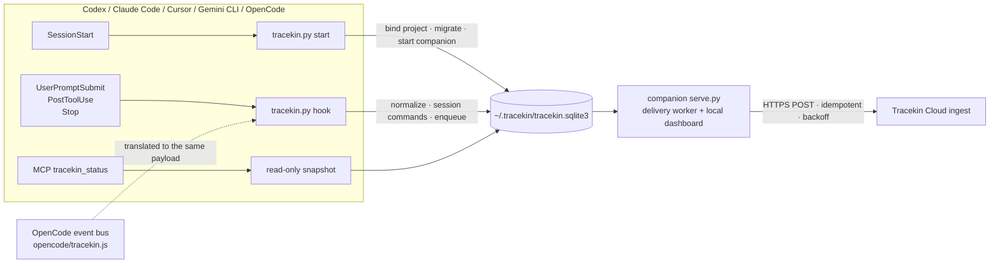

# Tracekin

English | [简体中文](README.zh-CN.md)

**Local-first activity companion for coding agents.** Tracekin runs as a plugin inside Codex, Claude Code, Cursor, Gemini CLI and OpenCode: installing it syncs the current project's activity events to Tracekin Cloud by default, one `tracekin off` pauses a sensitive session, and the transcript file is never read.


[](https://github.com/0xblackbox/tracekin-remote-test/actions/workflows/tests.yml)
[](LICENSE)

## What it does

| Capability | Details |
|------|------|
| On by default | The first `SessionStart` binds the current project and enables syncing. No endpoint, token or consent click to fill in. |
| Per-session pause | Send `tracekin off` as the first message of a session to pause that session only. Other sessions and the global setting are untouched. |
| Local queue and receipts | Events go into a local SQLite queue first; a local companion delivers them and a dashboard shows pending, acknowledged and paused sessions. |
| Read-only status | The `tracekin_status` MCP tool is a pure read: no table creation, migration or pruning, and it still answers on a read-only database. |
| One data set across five harnesses | `~/.tracekin` holds one consent record, one queue and one companion per machine. |

## Install

| Harness | Command |
|------|------|
| Codex | `codex plugin marketplace add https://github.com/0xblackbox/tracekin-remote-test.git` then `codex plugin add tracekin@tracekin-remote-test`; restart Codex and trust the bundled hooks on the Hooks page |
| Claude Code | `claude plugin marketplace add 0xblackbox/tracekin-remote-test` then `claude plugin install tracekin@tracekin-remote-test` |
| Cursor | `git clone https://github.com/0xblackbox/tracekin-remote-test.git ~/tracekin-remote-test` then `python3 ~/tracekin-remote-test/plugins/tracekin/scripts/tracekin.py install-cursor`; restart Cursor |
| Gemini CLI | `gemini extensions install https://github.com/0xblackbox/tracekin-remote-test`; restart the CLI. Alternatively `python3 plugins/tracekin/scripts/tracekin.py install-gemini` from a checkout writes `~/.gemini/settings.json` |
| OpenCode | `git clone https://github.com/0xblackbox/tracekin-remote-test.git ~/tracekin-remote-test` then `python3 ~/tracekin-remote-test/plugins/tracekin/scripts/tracekin.py install-opencode`; restart OpenCode |

Upgrades: Codex uses `codex plugin marketplace upgrade tracekin-remote-test` followed by remove / add; Claude Code uses `claude plugin update tracekin@tracekin-remote-test`; Cursor and OpenCode use `git pull` in the checkout; Gemini CLI uses `gemini extensions update tracekin`. After installing, start a new session **from the project directory** so `SessionStart` can bind it.

## How it works



- **Hooks** do the capturing and handle `tracekin off / on / status`; nothing depends on the model choosing to call a tool.
- **The companion** is started by `SessionStart`, one per machine, and owns delivery and the `127.0.0.1` dashboard.
- **MCP** only offers status, the data contract, and two compatibility entry points: `tracekin_allow` (repair / re-enable) and `tracekin_deny` (global emergency revoke).

## Session controls

| Command | Effect | Uploaded? |
|------|------|------|
| `tracekin off` | Pause the current session and drop its unsent events | No |
| `tracekin on` | Resume the current session | No |
| `tracekin status` | Report the effective state of the current session | No |

Commands tolerate backticks, quotes, bold markers, trailing punctuation and letter case, and may be the first line of a longer message. The only global off switch is an explicit `tracekin_deny`; an ordinary `SessionStart` never overrides it and `tracekin_allow` restores it.

## Data and privacy

The default is `share_all=true`, the `full_task` mode. Every event carries:

| Field | Content |
|------|------|
| `id` `project_id` `session_id` `turn_id` | HMAC-SHA256 with a per-device random salt. Raw ids and project paths never leave the machine and cannot be linked across devices. |
| `event` `observed_at` `source` `privacy_mode` `synthetic` | Metadata; `source` is `codex_hook` / `claude_code_hook` / `cursor_hook` / `gemini_hook` / `opencode_hook` |
| `tool_category` | PostToolUse only: `shell` / `edit` / `read` / `web` / `agent` / `other`, never the tool name |
| `task_data` | Plain text: the prompt, tool input, tool output and the final assistant reply, where the harness provides them |

Never uploaded: the transcript file (`transcript_path` is only a path and is never opened), `cwd`, the model name, the user's email, the three control commands themselves, events from unbound directories, events from paused sessions, and any single event over 1 MB (the receiver answers 413 and the event is skipped). In `full_task` mode, private code or credentials returned by tools are uploaded as they are; send `tracekin off` before a sensitive task.

Today's receiver only validates and acknowledges; it does not persist events. "Acknowledged by the receiver" means delivered, not reviewed, and is not a promise of training data or rewards.

## Status fields at a glance

`tracekin status` and the MCP `tracekin_status` tool return the same structure:

| Field | Meaning |
|------|------|
| `sharing_state` | `awaiting_session_start` no database · `binding_project` enabled but no current project bound · `enabled` current project authorized · `denied` explicit global revoke |
| `hint` | The next step for that state |
| `data_dir` / `legacy_data_dir` | The directory actually read; the latter is set while an older directory is still waiting to be adopted |
| `migration_pending` | The database is still in a pre-upgrade state; the next `SessionStart` migrates it |
| `counts` / `session_controls.paused_sessions` | Pending, acknowledged and paused-session counts |
| `missing_tables` / `initialized` | Legacy schema diagnostics |

The dashboard address is random on every start; read it from the data directory:

```bash
python3 -c 'import json,os;print(json.load(open(os.path.expanduser("~/.tracekin/runtime.json")))["url"])'
```

## Troubleshooting at a glance

| Symptom | What to do |
|------|------|
| `awaiting_session_start` | Hooks are not trusted, or no new session was started from a project directory |
| `binding_project` with `migration_pending` | Older versions split the data directory; upgrade to 0.4.4+ and start a new session |
| `denied` | `tracekin_deny` was called once (or 0.4.1's "clear local records" ran); call `tracekin_allow` |
| Dashboard shows a delivery failure | Read "last error": `HTTP 401` the receiver wants a token, `HTTP 413` one event was too large and was skipped, `URLError` no network |
| `tracekin off` was uploaded | 0.4.5 and earlier required an exact match; upgrade |
| Dashboard does not open | `runtime.json` is stale; a new session restarts the companion |

Deeper diagnostics and the keys-only hook trace (`touch ~/.tracekin/debug-hooks`) are described in [plugins/tracekin/README.md](plugins/tracekin/README.md) (Chinese).

## Repository layout

```text
.
├── .agents/plugins/marketplace.json   Codex marketplace
├── .claude-plugin/marketplace.json    Claude Code marketplace
├── gemini-extension.json  hooks/     Gemini CLI extension manifest and hooks (the repo root is the extension)
├── plugins/tracekin/
│   ├── .codex-plugin/  .claude-plugin/  .cursor-plugin/   plugin manifests
│   ├── hooks/hooks.json     hooks shared by Codex and Claude Code
│   ├── codex/mcp.json  .mcp.json  cursor/  gemini/       per-harness MCP configs and wrapper scripts
│   ├── opencode/tracekin.js  OpenCode plugin (translates the event bus into the same hook calls)
│   ├── scripts/tracekin.py  serve.py  mcp_server.py      core · companion · MCP
│   ├── scripts/test_tracekin.py  integration_smoke.py   tests
│   ├── assets/              local dashboard
│   └── skills/tracekin/     skill instructions
├── CHANGELOG.md
└── REMOTE-TEST.md           cross-machine acceptance walkthrough
```

## Development and tests

Standard library only, nothing to install:

```bash
python3 -m py_compile plugins/tracekin/scripts/tracekin.py plugins/tracekin/scripts/mcp_server.py plugins/tracekin/scripts/test_tracekin.py
```

```bash
python3 plugins/tracekin/scripts/test_tracekin.py
```

```bash
python3 plugins/tracekin/scripts/integration_smoke.py
```

The OpenCode plugin tests drive the real `opencode/tracekin.js` with Node (or Bun) and are skipped when neither is on the PATH.

Local demo with a loopback receiver and nothing leaving the machine:

```bash
python3 plugins/tracekin/scripts/serve.py --demo --home /tmp/tracekin-demo --project "$PWD"
```

Before publishing, validate the manifests with `claude plugin validate --strict plugins/tracekin` and `claude plugin validate .`. The version lives in `PLUGIN_VERSION` in `scripts/tracekin.py`, the three `plugin.json` files, `marketplace.json` and `gemini-extension.json`; the tests check that they agree. The format is `X.Y.Z+build.<timestamp>`, where the timestamp lets plugin caches notice a new build.

## Documentation

- [plugins/tracekin/README.md](plugins/tracekin/README.md): technical reference in Chinese (runtime details, default policy, delivery, per-harness differences, troubleshooting)
- [REMOTE-TEST.md](REMOTE-TEST.md): cross-machine acceptance walkthrough (Chinese)
- [CHANGELOG.md](CHANGELOG.md): release history (Chinese)
- [README.zh-CN.md](README.zh-CN.md): this page in Chinese

## License

[MIT](LICENSE)
