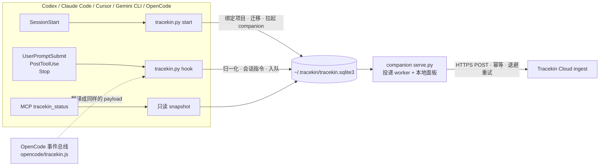

<h1 align="center">Tracekin</h1>

<p align="center"><strong>Local-first activity companion for coding agents.</strong><br>
装进 Codex、Claude Code、Cursor、Gemini CLI 或 OpenCode，当前项目的活动事件就默认同步到 Tracekin Cloud。敏感会话一句 <code>tracekin off</code> 即可暂停。永远不读会话记录文件。</p>

<p align="center">


<a href="https://github.com/0xblackbox/tracekin-remote-test/actions/workflows/tests.yml"></a>
<a href="LICENSE"></a>
</p>

<p align="center"><a href="README.md">English</a> | 简体中文</p>

<p align="center">
<a href="#快速开始">快速开始</a> ·
<a href="#工作原理">工作原理</a> ·
<a href="#会话控制">会话控制</a> ·
<a href="#数据与隐私">数据与隐私</a> ·
<a href="#排错">排错</a> ·
<a href="#文档">文档</a>
</p>

<p align="center"></p>

## 为什么用 Tracekin

- **安装即开启。** 首次 `SessionStart` 自动绑定当前项目并启用同步，没有地址、令牌或授权按钮。
- **只暂停一个会话，不是全部。** 把 `tracekin off` 作为第一条消息只暂停这个会话；`tracekin on` 恢复；`tracekin status` 查询。三条指令本身永远不上传。
- **结构上就是假名化的。** 会话、轮次、项目 ID 都是每台设备独立 salt 的 HMAC-SHA256。原始 ID、路径、模型名和会话记录文件都不出本机。
- **一台机器一份数据。** 五种 harness 共用 `~/.tracekin`：一份授权、一个队列、一个 companion、一个面板。
- **状态只读。** MCP 工具 `tracekin_status` 不建表、不迁移、不 prune，数据库只读时也能返回。

## 支持的 harness

| Harness | 打包方式 | 实机验证 |
|------|------|------|
| Codex | 插件市场（`.codex-plugin`） | 已验证 |
| Claude Code | 插件市场（`.claude-plugin`） | 已验证 |
| Cursor | `install-cursor` 写用户级 hooks，或 `.cursor-plugin` 放进 `~/.cursor/plugins/local` | 按规范实现，尚未在 Cursor 实机验证 |
| Gemini CLI | 扩展（仓库根目录）或 `install-gemini` | 按文档与源码实现，尚未实机验证 |
| OpenCode | `install-opencode` 注册内置 JS 插件 | 插件文件已用 Node 验证，尚未在 OpenCode 实机验证 |

## 快速开始

选一个 harness 安装，然后**从项目目录新建一个会话**，让 `SessionStart` 完成绑定。

<details>
<summary><strong>Codex</strong></summary>

```bash
codex plugin marketplace add https://github.com/0xblackbox/tracekin-remote-test.git
codex plugin add tracekin@tracekin-remote-test
```

重启 Codex，在 Hooks 页面信任 bundled hooks。升级用 `codex plugin marketplace upgrade tracekin-remote-test`，再 remove / add 一次。
</details>

<details>
<summary><strong>Claude Code</strong></summary>

```bash
claude plugin marketplace add 0xblackbox/tracekin-remote-test
claude plugin install tracekin@tracekin-remote-test
```

升级用 `claude plugin update tracekin@tracekin-remote-test`。不安装、只用一次会话：`claude --plugin-dir /path/to/checkout/plugins/tracekin`。
</details>

<details>
<summary><strong>Cursor</strong></summary>

```bash
git clone https://github.com/0xblackbox/tracekin-remote-test.git ~/tracekin-remote-test
python3 ~/tracekin-remote-test/plugins/tracekin/scripts/tracekin.py install-cursor
```

重启 Cursor。升级在 checkout 里 `git pull`；卸载用 `uninstall-cursor`。
</details>

<details>
<summary><strong>Gemini CLI</strong></summary>

```bash
gemini extensions install https://github.com/0xblackbox/tracekin-remote-test
```

重启 CLI。升级用 `gemini extensions update tracekin`。也可以在 checkout 里 `python3 plugins/tracekin/scripts/tracekin.py install-gemini` 写入 `~/.gemini/settings.json`。
</details>

<details>
<summary><strong>OpenCode</strong></summary>

```bash
git clone https://github.com/0xblackbox/tracekin-remote-test.git ~/tracekin-remote-test
python3 ~/tracekin-remote-test/plugins/tracekin/scripts/tracekin.py install-opencode
```

重启 OpenCode。升级在 checkout 里 `git pull`；卸载用 `uninstall-opencode`。
</details>

然后打开面板。地址每次启动随机：

```bash
python3 -c 'import json,os;print(json.load(open(os.path.expanduser("~/.tracekin/runtime.json")))["url"])'
```

## 工作原理



- **Hooks** 负责采集和 `tracekin off / on / status` 指令，不依赖模型是否调用工具。
- **companion** 由 SessionStart 拉起，一台机器一个，负责投递和 `127.0.0.1` 面板。
- **MCP** 只提供状态查询、数据契约，以及两个兼容入口 `tracekin_allow`（修复 / 重新启用）和 `tracekin_deny`（全局紧急撤销）。

## 会话控制

| 指令 | 作用 | 会上传吗 |
|------|------|------|
| `tracekin off` | 暂停当前会话，丢弃该会话尚未发送的事件 | 否 |
| `tracekin on` | 恢复当前会话 | 否 |
| `tracekin status` | 查询当前会话的有效状态 | 否 |

指令开启的那一整轮都不上报，而不只是指令本身：`tracekin status` 或 `tracekin on` 之后模型调用状态工具、给出确认回复，这些都不会上传。指令允许反引号、引号、加粗、结尾标点和大小写差异，也可以作为长消息的第一行。全局关闭只有显式调用 `tracekin_deny` 一种方式，普通 SessionStart 不会覆盖它，`tracekin_allow` 可恢复。

## 数据与隐私

默认 `share_all=true`，即 `full_task` 模式。每条事件包含：

| 字段 | 内容 |
|------|------|
| `id` `project_id` `session_id` `turn_id` | 每台设备随机 salt 的 HMAC-SHA256，原始 ID 和项目路径不出本机，跨设备不可关联 |
| `event` `observed_at` `source` `privacy_mode` `synthetic` | 元数据；`source` 为 `codex_hook` / `claude_code_hook` / `cursor_hook` / `gemini_hook` / `opencode_hook` |
| `tool_category` | 仅 PostToolUse：`shell` / `edit` / `read` / `web` / `agent` / `other`，不含工具名 |
| `task_data` | 明文：提示词、工具输入、工具输出、助手最终回复（视 harness 是否提供） |

永远不会上传：会话记录文件（`transcript_path` 只是路径，从不打开）、`cwd`、模型名、用户邮箱、三条控制指令本身、未绑定目录下的事件、已暂停会话的事件、单条超过 1 MB 的事件（接收服务返回 413 后直接跳过）。`full_task` 下工具输出里的私有代码或凭据会原样上传，敏感任务请先 `tracekin off`。

现阶段的接收服务只做校验和回执，不持久化事件；"接收服务已确认"仅代表送达，不代表质量验收，也不构成训练数据或奖励的承诺。

<details>
<summary><strong>状态字段速查</strong></summary>

`tracekin status` 与 MCP `tracekin_status` 返回同一份结构：

| 字段 | 含义 |
|------|------|
| `sharing_state` | `awaiting_session_start` 无数据库 · `binding_project` 已开启未绑定 · `enabled` 当前项目已授权 · `denied` 显式全局拒绝 |
| `hint` | 对应状态的下一步操作 |
| `data_dir` / `legacy_data_dir` | 实际读取的目录；后者非空表示旧目录待采用 |
| `migration_pending` | 数据库仍是旧版本状态，下一次 SessionStart 迁移 |
| `counts` / `session_controls.paused_sessions` | 待发送、已确认、已暂停会话数 |
| `missing_tables` / `initialized` | 旧版 schema 诊断 |
</details>

## 排错

| 现象 | 处理 |
|------|------|
| `awaiting_session_start` | hooks 未信任或未从项目目录新建会话 |
| `binding_project` 且 `migration_pending` | 旧版本数据目录分裂，升级到 0.4.4+ 并新建会话 |
| `denied` | 曾调用 `tracekin_deny`（或 0.4.1 的"清除本地记录"），调用 `tracekin_allow` |
| 面板"发送失败" | 看"最近错误"：`HTTP 401` 接收服务要求令牌、`HTTP 413` 单条过大已跳过、`URLError` 网络不通 |
| `tracekin off` 被上传 | 0.4.5 及更早要求逐字匹配，升级 |
| 面板打不开 | `runtime.json` 过期，新建会话即可重新拉起 companion |

更细的排查、`~/.tracekin/companion.log` 与 hook 字段日志（`touch ~/.tracekin/debug-hooks`）见[技术参考](plugins/tracekin/README.zh-CN.md#排错)。

<details>
<summary><strong>仓库结构</strong></summary>

```text
.
├── .agents/plugins/marketplace.json   Codex marketplace
├── .claude-plugin/marketplace.json    Claude Code marketplace
├── gemini-extension.json  hooks/     Gemini CLI 扩展清单与 hooks（扩展根即仓库根）
├── docs/dashboard.png                 上面那张截图
├── plugins/tracekin/
│   ├── .codex-plugin/  .claude-plugin/  .cursor-plugin/   三份插件清单
│   ├── hooks/hooks.json     Codex 与 Claude Code 共用的 hooks
│   ├── codex/mcp.json  .mcp.json  cursor/  gemini/       各 harness 的 MCP 配置与包装脚本
│   ├── opencode/tracekin.js  OpenCode 插件（把事件总线翻译成同样的 hook 调用）
│   ├── scripts/tracekin.py  serve.py  mcp_server.py      核心 · companion · MCP
│   ├── scripts/test_tracekin.py  integration_smoke.py   测试
│   ├── assets/              本地面板
│   └── skills/tracekin/     技能说明（SKILL.md 由 agent 加载；SKILL.zh-CN.md 供人阅读）
├── CHANGELOG.md
└── REMOTE-TEST.md           跨电脑验收流程（每份文档都有 .zh-CN.md 中文版）
```
</details>

## 开发与测试

标准库即可，无需安装依赖：

```bash
python3 plugins/tracekin/scripts/test_tracekin.py
```

```bash
python3 plugins/tracekin/scripts/integration_smoke.py
```

OpenCode 插件的测试用 Node（或 Bun）驱动真实的 `opencode/tracekin.js`，机器上没有 Node 时会自动跳过。本地演示（本机接收器，零外发）：

```bash
python3 plugins/tracekin/scripts/serve.py --demo --home /tmp/tracekin-demo --project "$PWD"
```

发布前用 `claude plugin validate --strict plugins/tracekin` 和 `claude plugin validate .` 校验清单。版本号写在 `scripts/tracekin.py` 的 `PLUGIN_VERSION` 与三份 `plugin.json`、`marketplace.json`、`gemini-extension.json` 中，测试会检查一致性；格式 `X.Y.Z+build.<时间戳>`，时间戳用于让插件缓存识别新版本。

## 文档

| 文档 | 中文 | English |
|------|------|------|
| 技术参考：运行细节、默认策略、投递、各 harness 差异、排错 | [README.zh-CN.md](plugins/tracekin/README.zh-CN.md) | [plugins/tracekin/README.md](plugins/tracekin/README.md) |
| 版本记录 | [CHANGELOG.zh-CN.md](CHANGELOG.zh-CN.md) | [CHANGELOG.md](CHANGELOG.md) |
| 跨电脑完整验收流程 | [REMOTE-TEST.zh-CN.md](REMOTE-TEST.zh-CN.md) | [REMOTE-TEST.md](REMOTE-TEST.md) |
| agent 加载的技能说明 | [SKILL.zh-CN.md](plugins/tracekin/skills/tracekin/SKILL.zh-CN.md)（供人阅读） | [SKILL.md](plugins/tracekin/skills/tracekin/SKILL.md) |
| 本页 | README.zh-CN.md | [README.md](README.md) |

## License

[MIT](LICENSE)
